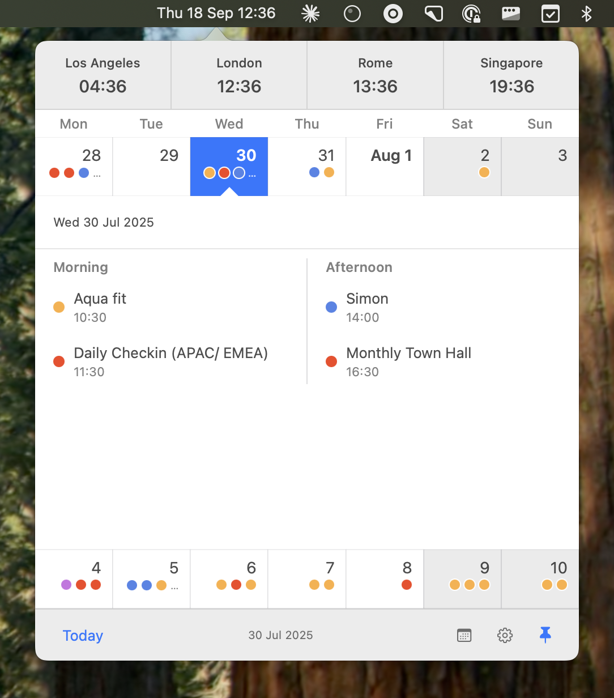

# Clonk

A macOS menu bar app that displays the current time and shows a delicious calendar popup when clicked.



## Installing

Download `Clonk.dmg` from [the latest release](https://github.com/johnbillion/clonk/releases) and install it like any other app.

Clonk is not currently signed, so the first time you attempt to open the app macOS will show you a warning and prevent it from opening.

1. Visit *System Settings* -> *Privacy & Security*
2. Scroll down and you'll see a message about Clonk and an option to allow it to run
3. Allow it and the open the app again

### How do I hide the built-in macOS clock?

There is no way to fully hide the macOS clock in the menu bar. The best approach is to minimise its appearance.

1. Go to *System Settings* -> *Control Centre*
2. Scroll down and click *Clock Options*
3. Coose *Analogue* for the menu bar clock style

## Building and Running

### Option 1: Command Line (No Xcode Required)

**Prerequisites:**
- macOS 14.0 or later
- Command Line Tools for Xcode: `xcode-select --install`

**Build and run:**
```bash
cd Clonk
./build.sh
open build/Clonk.app
```

**Development:**
```bash
# Live reload (auto rebuild on file changes)
./live.sh
```

**Using Swift Package Manager:**
```bash
swift build
swift run Clonk
```

### Option 2: Xcode

1. Open `Clonk.xcodeproj` in Xcode
2. Select your development team in the project settings (if needed for code signing)
3. Build and run (⌘+R)
4. The app will appear in your menu bar
